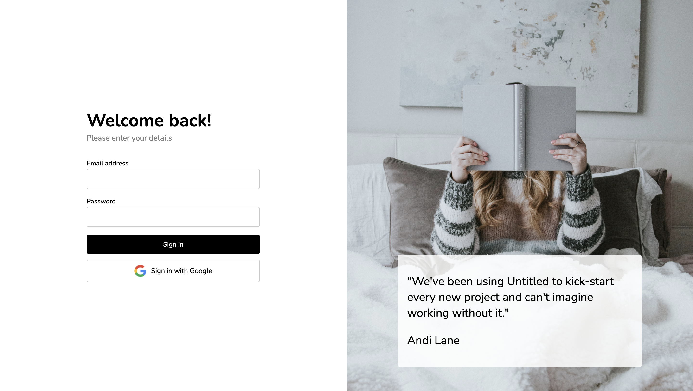

# Sign in

## Éléments

Couleurs :
```
Blanc : #ffffff;
Blanc opacity 85 : rgba(255, 255, 255, 0.85);
Noir : #000000;
Gris clair : #cbcbcb;
Gris : rgb(128, 128, 128);

```

Police de caractères
```
Nunito en 200, 300, 400, 500, 600 et 700
```

## Preview


